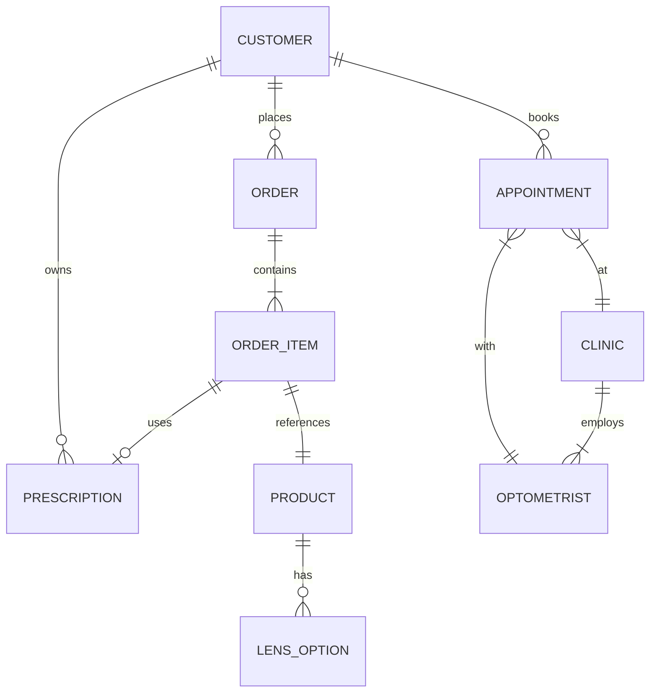

# Mansi Opticals — Omnichannel Eyewear & Opticals Platform Architecture Specification

> [!NOTE]
> **Document Purpose**: This technical specification defines the high-performance architecture, data models, components, and SEO strategies for Mansi Opticals' unified e-commerce and clinical booking eyewear platform.

## 1. User Journey Mapping

### 1.1 Prescription Glasses Flow
The highest-friction flow requiring seamless transitions between product selection and medical data collection.
1. **Frame Selection**: User browses frames (PLP) -> Views details (PDP) -> Initiates Virtual Try-On (Webcam/AR).
2. **Lens Customization (The "Builder")**:
   - Step 1: Usage (Single Vision, Progressive, Non-prescription).
   - Step 2: Lens Type (Clear, Blue-cut, Photochromic/Transitions, Sunglasses).
   - Step 3: Thickness/Index (Standard 1.50, Thin 1.61, Ultra-Thin 1.67, etc.).
3. **Prescription Acquisition**:
   - Option A: Upload image/PDF (triggers async OCR extraction + manual verification queue).
   - Option B: Manual entry (Sph, Cyl, Axis, Add, PD).
   - Option C: "I'll provide it later" (Sends follow-up email sequence).
4. **PD Measurement**: If PD is missing, launch the WebRTC-based `PDCalculatorModal`.
5. **Checkout**: Standard e-commerce checkout with order lifecycle hooked to prescription verification.

### 1.2 Clinical Booking Flow
Strict HIPAA-compliant scheduling integrated with store operations.
1. **Location Search**: Geolocation prompt -> Map view of nearby clinics/stores.
2. **Service Selection**: Comprehensive Eye Exam, Contact Lens Fitting, Follow-up.
3. **Optometrist & Slot Selection**: Fetch real-time availability via Booking Engine.
4. **Patient Intake**: Pre-visit questionnaire (Symptoms, current insurance, medical history). Data encrypted at rest.
5. **Confirmation**: SMS/Email calendar invite dispatch and CRM logging.

### 1.3 Contact Lens Reorder Flow
Optimized for speed and recurring revenue.
1. **Selection**: User selects Brand/Model.
2. **Power Entry**: Simplified grid for OD (Right Eye) and OS (Left Eye) power, base curve, and diameter.
3. **Subscription Cadence**: Prompt to "Subscribe & Save" (e.g., every 3, 6, 12 months).
4. **Prescription Check**: Verify active contact lens prescription on file, or prompt for upload.
5. **Express Checkout**: 1-click checkout leveraging saved payment methods (Apple Pay/Google Pay).

---

## 2. Data Architecture & Schemas

### 2.1 Entity Relationship Diagram



### 2.2 Core JSON Schemas

> [!IMPORTANT]
> **HIPAA Compliance**: The `Prescription` and `CustomerProfile` schemas contain Protected Health Information (PHI). These records must be encrypted at rest, and access requires strict Role-Based Access Control (RBAC) and audit logging.

**1. Product Schema (Frames/Lenses)**
```json
{
  "$schema": "http://json-schema.org/draft-07/schema#",
  "title": "Product",
  "type": "object",
  "properties": {
    "id": { "type": "string" },
    "type": { "type": "string", "enum": ["FRAME", "SUNGLASSES", "CONTACT_LENS", "LENS_ADDON"] },
    "brand": { "type": "string" },
    "modelName": { "type": "string" },
    "sku": { "type": "string" },
    "price": { "type": "number" },
    "attributes": {
      "type": "object",
      "properties": {
        "color": { "type": "string" },
        "shape": { "type": "string" },
        "material": { "type": "string" },
        "measurements": {
          "type": "object",
          "properties": {
            "bridge": { "type": "number" },
            "lensWidth": { "type": "number" },
            "templeLength": { "type": "number" }
          }
        }
      }
    },
    "assets": {
      "type": "object",
      "properties": {
        "images": { "type": "array", "items": { "type": "string", "format": "uri" } },
        "arModelUrl": { "type": "string", "format": "uri" }
      }
    }
  }
}
```

**2. Prescription Schema**
```json
{
  "$schema": "http://json-schema.org/draft-07/schema#",
  "title": "Prescription",
  "type": "object",
  "properties": {
    "id": { "type": "string" },
    "customerId": { "type": "string" },
    "type": { "type": "string", "enum": ["GLASSES", "CONTACTS"] },
    "issueDate": { "type": "string", "format": "date-time" },
    "expiryDate": { "type": "string", "format": "date-time" },
    "verificationStatus": { "type": "string", "enum": ["PENDING", "VERIFIED", "REJECTED", "EXPIRED"] },
    "measurements": {
      "type": "object",
      "properties": {
        "od": { "$ref": "#/definitions/eyeMeasurement" },
        "os": { "$ref": "#/definitions/eyeMeasurement" },
        "pd": { "type": "number" }
      }
    },
    "documentUrl": { "type": "string", "format": "uri" }
  },
  "definitions": {
    "eyeMeasurement": {
      "type": "object",
      "properties": {
        "sphere": { "type": "number" },
        "cylinder": { "type": "number" },
        "axis": { "type": "number" },
        "add": { "type": "number" }
      }
    }
  }
}
```

**3. BookingSlot Schema**
```json
{
  "$schema": "http://json-schema.org/draft-07/schema#",
  "title": "BookingSlot",
  "type": "object",
  "properties": {
    "id": { "type": "string" },
    "clinicId": { "type": "string" },
    "optometristId": { "type": "string" },
    "startTime": { "type": "string", "format": "date-time" },
    "endTime": { "type": "string", "format": "date-time" },
    "status": { "type": "string", "enum": ["AVAILABLE", "BOOKED", "BLOCKED"] },
    "serviceType": { "type": "string" }
  }
}
```

---

## 3. Component Inventory (Atomic Design)

*A total of 35 UI components, built for extreme reusability and accessibility (WCAG 2.1 AA).*

### Atoms (14)
1. `Button` (Primary, Secondary, Ghost, Danger)
2. `InputField` (Text, Number, Date, Password)
3. `Label` (Form labels with required indicators)
4. `Checkbox` (Custom styled toggle)
5. `RadioGroupItem` (For lens selections)
6. `Avatar` (User profile / Optometrist headshot)
7. `Icon` (SVG wrapper for optical-specific iconography)
8. `Spinner` (Loading state indicator)
9. `Tooltip` (For explaining complex optical terms like 'Sphere' or 'Index')
10. `Badge` (Status indicators: "Verified", "In Lab")
11. `Divider` (Section separators)
12. `PriceTag` (Formats currency, shows strikethrough for discounts)
13. `ColorSwatch` (Frame color selection)
14. `Typography` (Standardized headings, body text)

### Molecules (10)
1. `FormField` (Combines Label, InputField, and Error text)
2. `SearchBar` (Input + Search Icon + clear button)
3. `ProductCard` (Image, Title, Price, ColorSwatches, Favorite button)
4. `SlotPicker` (Date carousel + time block buttons)
5. `StepIndicator` (Breadcrumbs/Progress for Lens Builder)
6. `PrescriptionInputRow` (Grouped inputs for OD/OS: Sph, Cyl, Axis, Add)
7. `ARViewerToggle` (Button to switch between 2D image and 3D AR view)
8. `NotificationToast` (Success/Error feedback messages)
9. `QuantitySelector` (For contact lens boxes)
10. `FilterAccordion` (Collapsible sections for PLP filters)

### Organisms (11)
1. `Header` (Mega-menu, Search, Cart icon, Account)
2. `Footer` (Links, Newsletter, Location directory)
3. `HeroBanner` (Dynamic promotional slider/video)
4. `LensCustomizerStep` (Complex form orchestrating multiple Molecules for lens config)
5. `PrescriptionUploader` (Drag-and-drop zone + OCR loading state + fallback manual entry)
6. `PDCalculatorModal` (Webcam access, face detection overlay, calculation logic)
7. `ProductGrid` (Responsive grid of ProductCards with infinite scroll/pagination)
8. `AppointmentCalendar` (Full booking interface: Clinic selection + SlotPicker + Intake form)
9. `CartDrawer` (Slide-out summarizing frames, lenses, and subtotal)
10. `CheckoutForm` (Shipping, Billing, Payment gateway integration)
11. `OrderTimelineTracker` (Visual pipeline: Verification -> Lab -> Fitting -> Dispatch)

---

## 4. Page Blueprints

### 4.1 Home Page
- **Hero**: Auto-playing lightweight video background (high contrast), Primary CTA ("Shop Glasses", "Book Exam").
- **Value Props**: 3-column icon grid (e.g., Free Shipping, Virtual Try-On, 1-Year Warranty).
- **Featured Categories**: Horizontal scrollable cards (Men, Women, Sunglasses, Contacts).
- **Nearby Clinic Module**: Requires geolocation, shows nearest clinic with next available appointment slot.

### 4.2 Product Listing Page (PLP)
- **Sidebar**: Faceted filtering (Shape, Width, Material, Color, Price, Virtual Try-On enabled).
- **Main Grid**: Lazy-loaded `ProductCard` grid. Next.js `<Image>` for immediate above-the-fold render.
- **SEO Banner**: H1 and descriptive text at top or bottom for category keywords.

### 4.3 Product Detail Page (PDP)
- **Media Gallery**: Large hero image, thumbnail strip. Includes 3D `.gltf` viewer and AR launch button.
- **Purchase Interface**: Sticky on mobile. Includes Frame specs, Color selector, and "Select Lenses & Buy" main CTA.
- **Accordion Info**: Delivery info, Return policy, Frame measurements.

### 4.4 Lens Builder & Prescription Portal
- **Layout**: Distraction-free, multi-step layout (No main navigation header to prevent funnel drop-off).
- **Sections**: Usage -> Lens Type -> Index/Thickness -> Prescription Upload.
- **Security**: The Prescription upload step must explicitly state data privacy measures and route uploads directly to secure storage (bypassing public CDN).

### 4.5 Appointment Booking
- **Step 1**: Clinic Finder (Mapbox/Google Maps integration).
- **Step 2**: Optometrist/Service selection.
- **Step 3**: `SlotPicker` populated by real-time backend API.
- **Step 4**: Secure intake form.

### 4.6 Order Tracking
- **Authentication**: Requires email/order number combination or account login.
- **Visualization**: `OrderTimelineTracker` Organism. Shows granular statuses specific to opticals (e.g., "Prescription Rejected - Need New Copy" or "Lenses being cut at Lab").

---

## 5. Technology Stack Recommendation

To achieve sub-second TTI and flawlessly responsive architecture, a Jamstack/SSR hybrid approach is required.

> [!TIP]
> **Why this stack?** It decouples the slow, legacy healthcare/optical backend systems from the ultra-fast frontend presentation layer, ensuring high conversion rates.

* **Frontend Framework**: **Next.js 14+ (App Router)** - SSR for initial load SEO, RSC (React Server Components) for reducing client bundle size.
* **Styling**: **Tailwind CSS** + **Radix UI** (for accessible, unstyled primitives).
* **Headless Commerce Engine**: **Shopify Plus** (via Storefront API) OR **Medusa.js** (for deeper custom product data structures needed by complex lens combinations).
* **Booking/Scheduling Engine**: **Cal.com** infrastructure or custom microservice connected to legacy clinic PMS (Practice Management System) via secure webhooks.
* **Database**: **PostgreSQL** (hosted on Supabase or Neon). Strict Row Level Security (RLS) policies for PHI/Prescriptions.
* **Asset/Media Delivery**: **Cloudinary** or **Vercel Blob** + CDN. 
* **AR/3D Engine**: **Google model-viewer** (`<model-viewer>`) for performant web-based 3D and AR iOS/Android deep-linking.
* **OCR/Prescription Parsing**: Custom Python microservice using **AWS Textract** or **Google Cloud Vision API** with medical models.
* **State Management**: **Zustand** (for complex Lens Builder state) and **React Query / SWR** (for data fetching and caching).

---

## 6. Performance Benchmarks & Core Web Vitals

To maintain high conversion rates and SEO dominance, the platform must strictly adhere to the following targets.

| Metric | Target | Optimization Strategy |
| :--- | :--- | :--- |
| **LCP (Largest Contentful Paint)** | `< 1.5s` | Preload critical hero images. Serve WebP/AVIF via edge CDN. Inline critical CSS. Server-side render above-the-fold content. |
| **INP (Interaction to Next Paint)** | `< 200ms` | Keep main thread clear. Use React `useTransition` for heavy UI updates (like filtering the PLP). Defer third-party scripts (analytics, chat). |
| **CLS (Cumulative Layout Shift)** | `< 0.05` | Strict `aspect-ratio` on all product images. Pre-allocate DOM space for dynamic components (like the 3D AR viewer). |
| **TTI (Time to Interactive)** | `< 2.5s` | Code-split aggressively. Load Lens Builder JavaScript only when the user clicks "Select Lenses". |

**Asset Caching for 3D/AR**: 
AR models (`.gltf`, `.usdz`) can be 2-5MB. They must be aggressively cached via Service Workers (PWA) and edge CDNs. Load low-poly placeholders initially, streaming high-res textures asynchronously.

---

## 7. SEO & Structured Data Framework

A robust schema.org strategy is critical to capture both local clinical traffic and e-commerce product traffic.

### 7.1 Schema.org Implementation
- **Local Stores / Clinics**: `MedicalClinic`, `Optician`, or `LocalBusiness`. Must include GeoCoordinates, OpeningHours, and link to the appointment booking URL.
- **Products**: `Product` schema with `AggregateOffer`. Crucial for Google Shopping organic surfaces. Frames must define `color`, `material`, and `audience` (gender).
- **Services (Exams)**: `MedicalWebPage` and `MedicalBusiness` detailing the types of exams (Comprehensive, Contact Lens Fitting) and accepted insurances.

### 7.2 Routing & URL Structure
Use logical, faceted routing to create scalable landing pages.

* **E-commerce**: `/[locale]/shop/glasses/[gender]/[shape]` (e.g., `/en/shop/glasses/women/cat-eye`)
* **PDP**: `/[locale]/product/[brand-slug]/[model-slug]-[color-slug]` (e.g., `/en/product/ray-ban/wayfarer-black`)
* **Clinics**: `/[locale]/locations/[state]/[city]` (e.g., `/en/locations/ny/new-york`)
* **Booking**: `/[locale]/book/[clinic-id]`

### 7.3 Hreflang & Canonicalization
- Strict `rel="canonical"` tags on all PDPs and PLPs to prevent duplicate content issues from parameterized URLs (e.g., filtering options `?color=blue&shape=round`).
- Implement `hreflang` headers for multi-region setups (e.g., US English vs UK English).
